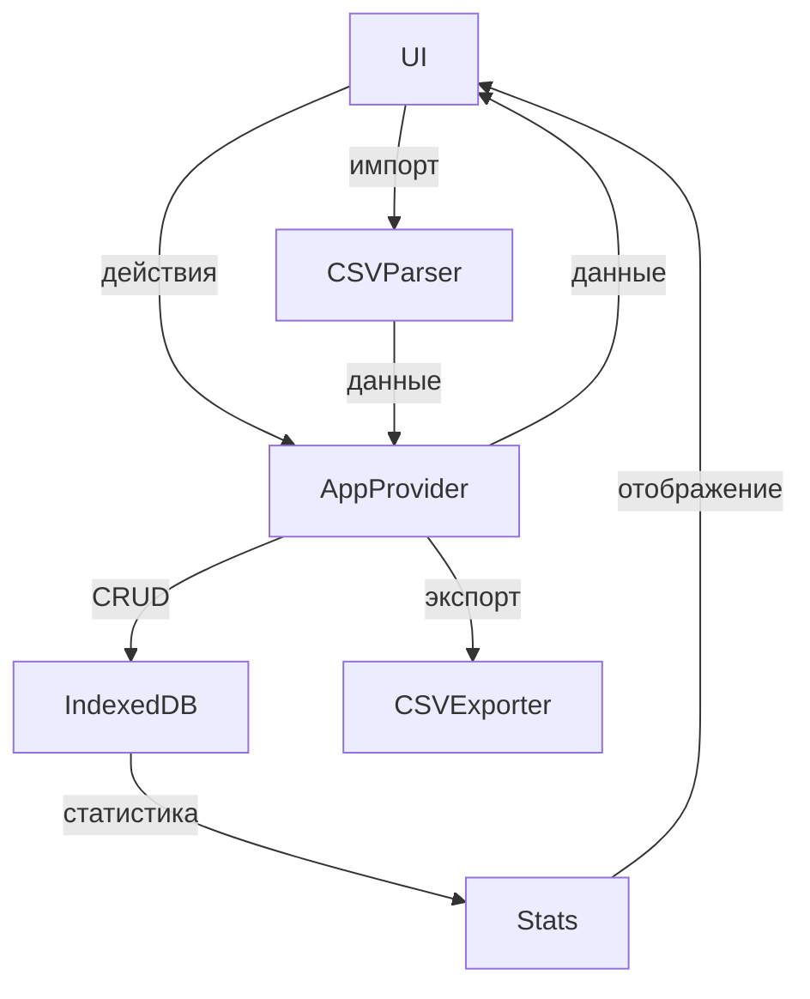

# Архитектура проекта

## Общая структура
- **Next.js 14 App Router**: современный роутинг, поддержка SSR/SSG, layout.
- **TypeScript**: строгая типизация, строгий режим.
- **Tailwind CSS**: кастомные токены, utility-first подход.
- **PWA**: офлайн-режим, IndexedDB через idb, сервис-воркер.
- **Глобальное состояние**: AppProvider (React Context API).
- **SM-2**: интервальное повторение для обучения.
- **Три режима обучения**: flashcards, learn, write.
- **Геймификация**: XP, уровни, достижения.
- **Экспорт/импорт**: CSV, планируется Anki/JSON.
- **Web Speech API**: произношение.
- **Background sync**: для будущей синхронизации.

## Основные директории
- `app/` — страницы и layout
- `components/` — UI-компоненты (screens, cards, providers)
- `features/` — бизнес-логика по фичам
- `lib/` — утилиты, модели, работа с БД, алгоритмы
- `public/` — статика, sw.js

## Потоки данных
- UI → AppProvider (Context) → IndexedDB (idb) → UI
- Импорт/экспорт: CSV → парсер → IndexedDB
- Статистика: IndexedDB → вычисления → UI

## Диаграмма (Mermaid)

## Ключевые сущности
- **Set**: id, name, cards[], createdAt, updatedAt
- **Card**: id, term, translation, progress, ...
- **Review**: id, cardId, setId, timestamp, quality

## Пример API (PWA, offline)
- Все операции с данными — через асинхронные функции в lib/db.ts
- Нет внешнего API, только локальное хранилище

## Расширяемость
- Легко добавить новые режимы обучения, категории, языки
- Возможна интеграция с внешними сервисами через background sync

---

# API (локальное)
- `getSets()`, `addSet()`, `updateSet()`, `deleteSet()`
- `getCards(setId)`, `addCard()`, `updateCard()`, `deleteCard()`
- `importCSV()`, `exportCSV()`
- `getStats()`, `updateStats()`

---

# TODO
- Диаграммы компонентов (по мере необходимости)
- Описание бизнес-логики SM-2, геймификации, статистики
