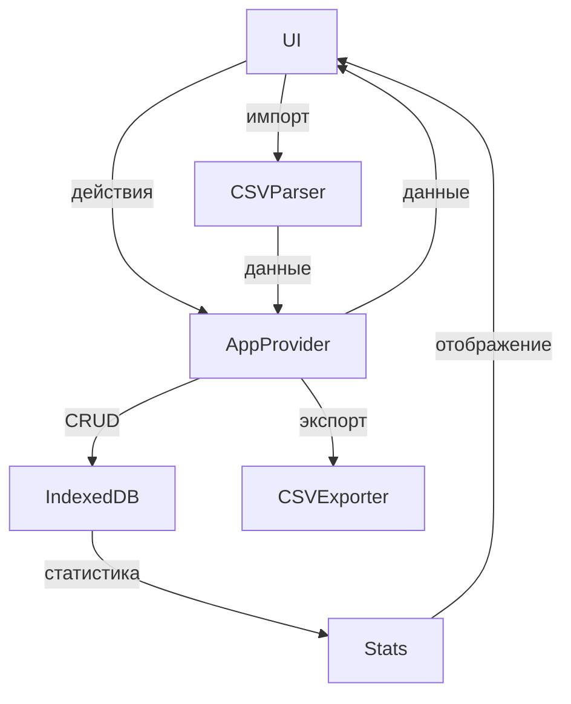
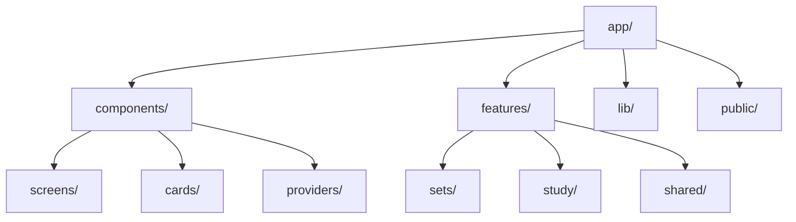

# Диаграммы архитектуры

## Потоки данных (Mermaid)

```mermaid
graph TD
  UI -->|действия| AppProvider
  AppProvider -->|CRUD| IndexedDB
  AppProvider -->|данные| UI
  UI -->|импорт| CSVParser
  CSVParser -->|данные| AppProvider
  AppProvider -->|экспорт| CSVExporter
  IndexedDB -->|статистика| Stats
  Stats -->|отображение| UI
```

## Структура директорий

```mermaid
graph TD
  A[app/] --> B[components/]
  A --> C[features/]
  A --> D[lib/]
  A --> E[public/]
  B --> F[screens/]
  B --> G[cards/]
  B --> H[providers/]
  C --> I[sets/]
  C --> J[study/]
  C --> K[shared/]
```

---

# TODO
- Диаграммы компонентов (по мере необходимости)
- Диаграммы бизнес-логики (SM-2, геймификация)
